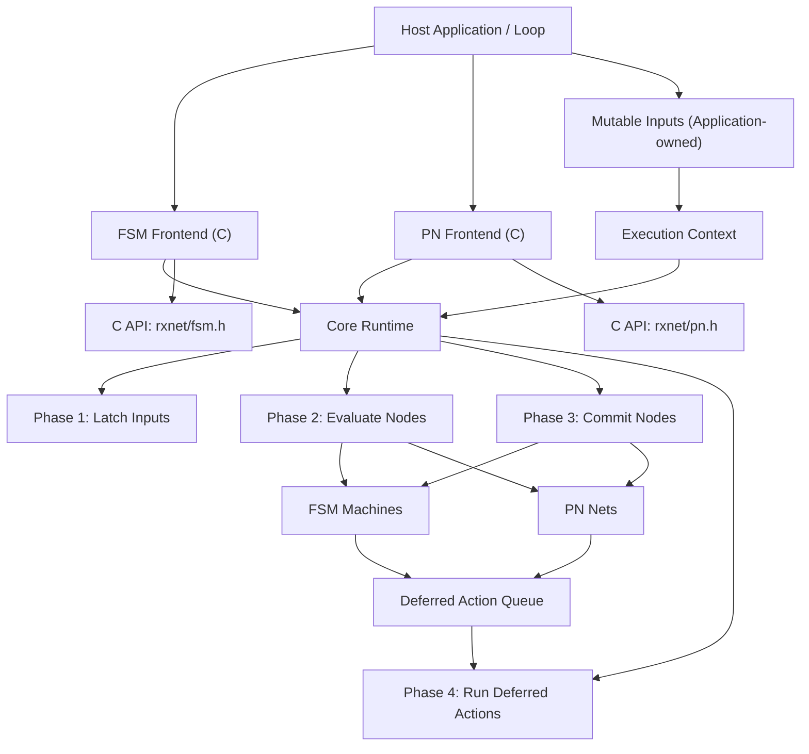

# Design Document: rxnet — C Implementation

## Overview

This document outlines the design for the C implementation of `rxnet`, a synchronous reactive runtime library with two model frontends (Finite State Machine and Petri Net) built on a shared phase-based core.

The core design decision is to centralize tick orchestration (`latch -> evaluate -> commit -> deferred actions`) and let each model frontend implement only model-specific behavior on top of a generic node contract.

The design emphasizes deterministic execution, explicit input snapshotting, deferred side effects, zero heap allocation during the tick path, and lightweight integration into host loops (CLI, embedded, or application-managed schedulers).

## Architecture

### High-Level Architecture

::: {#fig:c-hl-arch}

High-level architecture of the `rxnet` C runtime and model frontends
:::

### Component Architecture

The system follows a layered runtime architecture:

1. **Host Integration Layer**: Application-owned inputs, tick scheduling, and output side effects
2. **Model Frontends**: FSM and PN model APIs
3. **Core Runtime Layer**: Generic node container and phase-ordered tick execution
4. **Execution Context Layer**: Live inputs, latched snapshot, deferred action queue
5. **Model Nodes**: Concrete node implementations (`rx_fsm_machine`, `rx_pn_net`) with evaluate/commit logic

## Components and Interfaces

### Core Runtime

**Responsibilities:**
- Maintain a list of executable nodes
- Execute deterministic tick phases
- Coordinate context latch and deferred actions
- Provide minimal lifecycle surface (`init/add/tick/free`)

**Key Interfaces:**
```c
typedef struct rx_node rx_node;

typedef struct rx_node_vtable {
    void (*evaluate)(rx_node *node, rx_context *ctx);
    void (*commit)(rx_node *node, rx_context *ctx);
} rx_node_vtable;

typedef struct rx_node {
    const rx_node_vtable *vtable;
} rx_node;

int rx_runtime_init(rx_runtime *rt, rx_context *ctx, size_t node_capacity);
int rx_runtime_add_node(rx_runtime *rt, rx_node *node);
int rx_tick(rx_runtime *rt);
void rx_runtime_free(rx_runtime *rt);
```

### Context

**Responsibilities:**
- Queue and execute deferred actions after all commits
- Serve as the shared argument passed to every node phase callback

**Design Notes:**
- The context holds **no global input buffer**. Each node manages its own inputs (typically inside its `user` payload). The `latch_inputs` callback (phase 1 of the tick) is where each node takes its own stable snapshot before evaluation.
- Deferred-action queue uses a fixed-size array configured in `rxnet/config.h`; enqueue returns `-1` on overflow with no `malloc`/`realloc`

**Key Interfaces:**
```c
int  rx_context_init(rx_context *ctx);
rx_context *rx_context_create(void);
void rx_context_free(rx_context *ctx);
void rx_context_destroy(rx_context *ctx);
int  rx_context_enqueue_deferred_action(rx_context *ctx, rx_deferred_action_fn fn, void *user);
void rx_context_run_deferred_actions(rx_context *ctx);
```

### FSM Frontend

**Responsibilities:**
- Define machine transitions (`from_state`, `to_state`, `guard`, `action`)
- Evaluate first valid transition in declaration order
- Commit next state and enqueue optional deferred action
- Read shared latched inputs from context in guards/actions

**Key Interfaces:**
```c
typedef struct rx_fsm_runtime {
    rx_runtime runtime; /* base runtime (first member) */
    rx_context context;
} rx_fsm_runtime;

typedef struct rx_fsm_machine {
    rx_node node; /* base node */
    /* ... */
} rx_fsm_machine;

typedef int (*rx_fsm_guard_fn)(const rx_fsm_context *ctx, void *user);
typedef void (*rx_fsm_action_fn)(rx_fsm_context *ctx, void *user);

void rx_fsm_machine_init(
    rx_fsm_machine *machine,
    const char *name,
    int initial_state,
    const rx_fsm_transition *transitions,
    size_t transition_count,
    void *user,
    rx_fsm_node_phase_fn latch_inputs,   /* void (*)(rx_fsm_context*, void* user) */
    rx_fsm_node_phase_fn dump_outputs    /* void (*)(rx_fsm_context*, void* user) */
);
int rx_fsm_runtime_add_machine(rx_fsm_runtime *runtime, rx_fsm_machine *machine);
int rx_fsm_tick(rx_fsm_runtime *runtime);

rx_fsm_machine *rx_fsm_machine_create(/* same args as init */);
void rx_fsm_machine_destroy(rx_fsm_machine *machine);
```

### Petri Net Frontend

**Responsibilities:**
- Represent places and transitions with consume/produce arcs
- Evaluate transition enablement by token availability and guards
- Apply transition deltas in commit phase
- Enqueue transition actions as deferred side effects

**Key Interfaces:**
```c
typedef struct rx_pn_runtime {
    rx_runtime runtime; /* base runtime (first member) */
    rx_context context;
} rx_pn_runtime;

typedef struct rx_pn_net {
    rx_node node; /* base node */
    /* ... */
} rx_pn_net;

typedef struct rx_pn_arc {
    size_t place_id;
    int weight;
} rx_pn_arc;

typedef struct rx_pn_transition {
    const rx_pn_arc *consume;
    size_t consume_count;
    const rx_pn_arc *produce;
    size_t produce_count;
    rx_pn_guard_fn guard;
    rx_pn_action_fn action;
} rx_pn_transition;

int rx_pn_net_init(
    rx_pn_net *net,
    const char *name,
    const int *initial_places,
    size_t place_count,
    const rx_pn_transition *transitions,
    size_t transition_count,
    void *user,
    rx_pn_node_phase_fn latch_inputs,   /* void (*)(rx_pn_context*, void* user); NULL → noop */
    rx_pn_node_phase_fn dump_outputs    /* void (*)(rx_pn_context*, void* user); NULL → noop */
);
int rx_pn_runtime_add_net(rx_pn_runtime *runtime, rx_pn_net *net);
int rx_pn_tick(rx_pn_runtime *runtime);

rx_pn_net *rx_pn_net_create(/* same args as init */);
void rx_pn_net_destroy(rx_pn_net *net);
```

### Host Integration Layer

**Responsibilities:**
- Own and mutate live inputs before each tick (via node `user` payloads)
- Invoke tick in a periodic or event-driven loop
- Reset edge-triggered inputs when required by domain logic
- Implement side effects in action callbacks

**Concurrency patterns — all supported without library changes:**

| Pattern | Who calls `rx_tick` | Input writes | Synchronization needed |
|---|---|---|---|
| Cyclic executive | Single loop / main task | ISR (word-sized atomic) | None — latch takes snapshot at tick start |
| OS threads | Dedicated tick thread | Other threads | Mutex around input write AND tick call |
| RTOS cooperative | Tick task (woken by notification) | ISR or driver task (atomic) | None for atomic writes; semaphore to wake tick task |

**Cyclic executive (bare-metal):**
```c
/* ISR: word-sized write is atomic on ARM Cortex-M */
void BUTTON_IRQHandler(void) { inputs.button = 1; }

/* Main loop: */
while (1) {
    rx_fsm_tick(&runtime);
    /* dump outputs, sleep to next period */
}
```

**Threads (POSIX):**
```c
/* Writer thread: */
pthread_mutex_lock(&lock);
inputs.button = 1;
pthread_mutex_unlock(&lock);

/* Tick thread: */
while (1) {
    pthread_mutex_lock(&lock);
    rx_fsm_tick(&runtime);
    pthread_mutex_unlock(&lock);
    nanosleep(&period, NULL);
}
```

**RTOS cooperative (FreeRTOS):**
```c
/* ISR or driver task: */
void button_isr(void) {
    inputs.button = 1;                  /* atomic word write */
    xTaskNotifyGive(tick_task_handle);  /* wake tick task */
}

/* Tick task: */
void tick_task(void *arg) {
    while (1) {
        ulTaskNotifyTake(pdTRUE, portMAX_DELAY);
        rx_fsm_tick(&runtime);
    }
}
```

**Mixing FSM and PN in a single base runtime:**

`rx_fsm_machine` and `rx_pn_net` both embed `rx_node` as their first member.  Any number of them can be registered with one `rx_runtime` and advanced by a single `rx_tick` call:

```c
rx_context     ctx;
rx_runtime     rt;
rx_fsm_machine light_a;   /* FSM node */
rx_pn_net      light_b;   /* PN node  */

rx_context_init(&ctx);
rx_runtime_init(&rt, &ctx, 2);

light_fsm_create(&light_a, BUTTON_A, LIGHT_A);
light_pn_init(&light_b, BUTTON_B, LIGHT_B);

rx_runtime_add_node(&rt, &light_a.node);
rx_runtime_add_node(&rt, &light_b.node);

while (1) {
    rx_tick(&rt);          /* advances both light_a (FSM) and light_b (PN) */
}
```

See `examples/mixed/main_cli.c` for a full working example.

### Reusable CLI FSM Utility (Example Layer)

**Responsibilities:**
- Run non-blocking character intake from `stdin` inside an FSM machine
- Buffer command line input and dispatch handlers on Enter
- Provide command registration API with per-command `user_data`
- Provide machine-level `user_data` and optional per-tick hook for integration-specific logic
- Encapsulate terminal raw mode lifecycle (enter/restore) inside the utility

**Key Interfaces:**
```c
typedef struct cli_machine_data cli_machine_data;

typedef void (*cli_fsm_command_fn)(
    rx_fsm_context *ctx,
    cli_machine_data *cli,
    const char *command,
    void *command_user_data
);

typedef void (*cli_fsm_tick_fn)(
    const rx_fsm_context *ctx,
    cli_machine_data *cli,
    void *user_data
);

void cli_fsm_data_init(cli_machine_data *data, void *user_data);
int cli_fsm_register_command(
    cli_machine_data *data,
    const char *name,
    cli_fsm_command_fn handler,
    void *command_user_data
);
void cli_fsm_create(rx_fsm_machine *machine, const char *name, cli_machine_data *data);
```

**Design Notes:**
- `main_cli.c` remains focused on runtime wiring and periodic ticking; command semantics live in command handlers
- The CLI utility is reusable across examples because it has no domain-specific references
- Command handlers can use both machine-level `cli->user_data` and per-command `command_user_data` depending on reuse needs

## Data Models

### Runtime Model

```typescript
interface RuntimeModel {
  context: ContextModel
  nodes: NodeModel[]
  tickPhases: ['latch', 'evaluate', 'commit', 'deferred']
}

interface ContextModel {
  inputs: unknown
  latchedInputs: unknown
  deferredActions: DeferredActionModel[]
}

interface DeferredActionModel {
  fn: Function
  user: unknown
}
```

### FSM Model

```typescript
interface FSMMachineModel {
  name: string
  state: number
  nextState: number
  transitions: FSMTransitionModel[]
  user?: unknown
}

interface FSMTransitionModel {
  fromState: number
  toState: number
  guard?: (ctx: unknown, user: unknown) => boolean
  action?: (ctx: unknown, user: unknown) => void
}
```

### PN Model

```typescript
interface PNNetModel {
  name: string
  places: number[]
  nextPlaces: number[]
  transitions: PNTransitionModel[]
  fireFlags: boolean[]
  user?: unknown
}

interface PNTransitionModel {
  consume: PNArcModel[]
  produce: PNArcModel[]
  guard?: (ctx: unknown, user: unknown) => boolean
  action?: (ctx: unknown, user: unknown) => void
}

interface PNArcModel {
  placeId: number
  weight: number
}
```

## Correctness Properties

*A property is a behavior that should hold for all valid executions. Properties connect requirements with verifiable guarantees in unit, integration, and property-based tests.*

### Property 1: Phase Ordering Determinism
*For any* tick execution, phase order should always be `latch -> evaluate -> commit -> deferred`.
**Validates: Requirements 1.1, 1.2, 1.3, 1.4, 1.5**

### Property 2: Snapshot Consistency Within Tick
*For any* guard evaluation during one tick, observed inputs should come from each node's latched snapshot (taken in phase 1) and remain stable for that tick.
**Validates: Requirements 2.1, 2.2, 2.3**

### Property 3: Deferred Action Isolation
*For any* action emitted during commit, execution should occur only after all nodes have completed commit.
**Validates: Requirements 3.1, 3.2**

### Property 4: Deferred Queue Reset
*For any* completed tick, deferred queue length should be zero after running deferred actions.
**Validates: Requirements 3.3**

### Property 4b: Deferred Queue Overflow Determinism
*For any* tick where deferred enqueue exceeds configured capacity, enqueue should return `-1` and perform no dynamic allocation.
**Validates: Requirements 3.4, 3.6, 14.6**

### Property 5: Runtime Node Contract Safety
*For any* node registered in the runtime, `evaluate` and `commit` should both be callable in every tick.
**Validates: Requirements 4.1**

### Property 6: Node Capacity Enforcement
*For any* runtime initialized with capacity `N`, adding more than `N` nodes should fail with `-1`.
**Validates: Requirements 4.2, 4.3**

### Property 6b: Init Capacity Bound Checks
*For any* runtime/context initialization with capacities greater than configured maxima, initialization should fail with `-1`.
**Validates: Requirements 2.5, 4.5, 14.7**

### Property 7: FSM First-Match Transition Rule
*For any* FSM machine and state, transition selection should be the first declaration-order transition that matches state and guard.
**Validates: Requirements 5.1, 5.2**

### Property 8: FSM No-Match Stability
*For any* FSM tick with no valid transition, machine state should remain unchanged.
**Validates: Requirements 5.3**

### Property 9: FSM Deferred Action Behavior
*For any* matched FSM transition with action, the action should be queued for deferred execution, not run inline.
**Validates: Requirements 5.5**

### Property 10: FSM Input Snapshot Access
*For any* FSM machine, guards should read from the latched input snapshot (captured in `latch_inputs_cb`) and not mutate it.
**Validates: Requirements 6.1, 6.2, 6.3**

### Property 11: PN Transition Enablement
*For any* PN transition, firing should require valid arcs and sufficient consume tokens.
**Validates: Requirements 7.2**

### Property 12: PN Guard Enforcement
*For any* enabled PN transition with guard, transition should fire only when guard is true.
**Validates: Requirements 7.3**

### Property 13: PN Commit Delta Correctness
*For any* set of fireable PN transitions, place deltas should match arc consume/produce sums in commit.
**Validates: Requirements 7.4**

### Property 14: PN Arc Validation
*For any* PN net init with invalid arc index or negative weight, init should fail with `-1`.
**Validates: Requirements 8.1, 8.2**

### Property 15: Lifecycle Idempotent Safety
*For any* `*_free(NULL)` call, operation should be safe and not crash.
**Validates: Requirements 9.5**

### Property 16: Context Ownership Boundary
*For any* runtime lifecycle, external input buffer should not be freed by runtime/context cleanup.
**Validates: Requirements 2.4, 9.4**

### Property 17: Example Executability
*For any* provided C example entrypoint, example should run and complete without runtime errors in a valid toolchain.
**Validates: Requirements 10.1, 10.2, 10.3**

### Property 18: Host-Controlled Scheduling
*For any* deployment context, tick frequency and loop ownership should remain controlled by host code, not by runtime internals.
**Validates: Requirements 14.3**

## Error Handling

### Error Categories

**1. API Misuse Errors (return-code based)**
- Null pointers in required parameters
- Capacity overflow in node registration
- Invalid PN initialization data (arcs, buffers)

**2. Allocation and Resource Errors**
- Context buffer allocation failure
- Deferred queue capacity exhaustion (enqueue rejection)
- Net internal array allocation failure

**3. Integration Errors**
- Host passes invalid input lifetimes
- Host loop omits input reset logic for edge-triggered signals

### Error Handling Strategy

**Explicit status codes:**
- Initialization and tick APIs return `0` on success, `-1` on failure
- Cleanup APIs are null-safe and best-effort
- Partial init failures trigger cleanup of already allocated resources

**Host strategy: explicit loop ownership**
- Host checks return codes per tick
- Host applies retry/abort policy appropriate to runtime context (CLI/embedded)

## Testing Strategy

### Unit and Integration Tests

**Unit Tests focus on:**
- Per-function semantics in runtime/fsm/pn layers
- Edge cases (empty transitions, zero-capacity runtime, invalid arcs)
- Correct deferred action behavior

**Integration Tests focus on:**
- Host inputs mutation -> runtime tick -> state update -> deferred side effects
- Multiple nodes sharing one context input struct
- FSM guards reading shared latched inputs
- C host example builds (`gcc`) for FSM and PN
- ESP-IDF example compile-level validation

**Property Tests focus on:**
- Tick-order invariants
- PN token conservation and transition correctness across randomized nets
- FSM deterministic transition ordering across randomized transition lists

### Property-Based Testing Configuration

- C: randomized harness plus deterministic replay seeds
- Minimum 100 runs per property
- Each property references its design property number
- Seeded reproducibility for failure triage

## Code Quality and Development Standards

- Compile with `-std=c11 -Wall -Wextra -Wpedantic`
- Preserve null-safety checks and explicit error returns
- Keep ownership boundaries explicit (runtime-owned vs host-owned memory)
- The tick path (`latch`, `evaluate`, `commit`, `run deferred actions`) SHALL perform no heap allocation

## Non-Goals and Out-of-Scope

- No built-in networking or REST API layer
- No built-in persistence, serialization, or storage backends
- No built-in scheduler, thread pool, or realtime policy manager
- No automatic synchronization for concurrent access to one runtime instance

These concerns are intentionally delegated to host applications.
