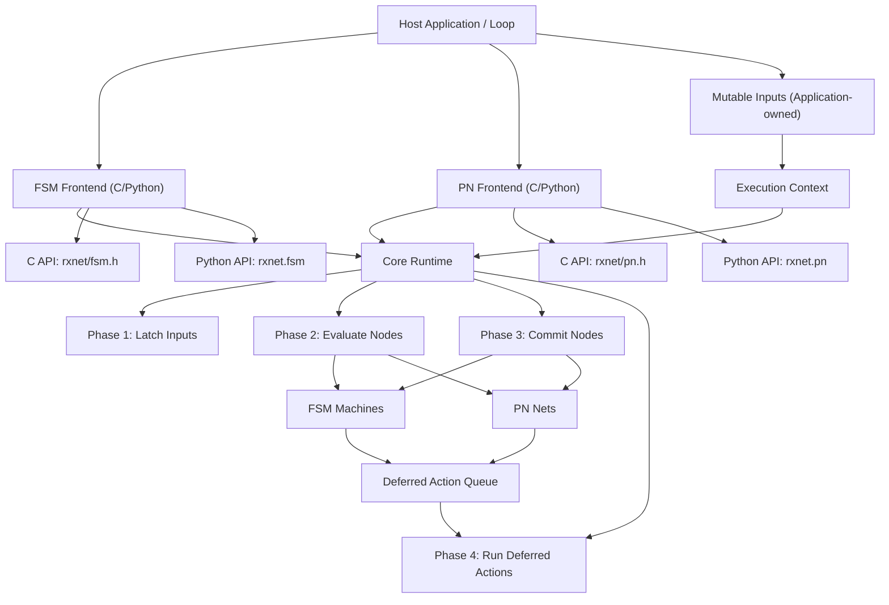

# Design Document: rxnet

## Overview

This document outlines the design for `rxnet`, a synchronous reactive runtime library with two model frontends (Finite State Machine and Petri Net) built on a shared phase-based core.

`rxnet` is implemented in C and Python with equivalent execution semantics. The core design decision is to centralize tick orchestration (`latch -> evaluate -> commit -> deferred actions`) and let each model frontend implement only model-specific behavior on top of a generic node contract.

The design emphasizes deterministic execution, explicit input snapshotting, deferred side effects, and lightweight integration into host loops (CLI, embedded, or application-managed schedulers).

## Architecture

### High-Level Architecture

::: {#fig:hl-arch}

High-level architecture of the `rxnet` runtime and model frontends
:::

### Component Architecture

The system follows a layered runtime architecture:

1. **Host Integration Layer**: Application-owned inputs, tick scheduling, and output side effects
2. **Model Frontends**: FSM and PN model APIs (C and Python)
3. **Core Runtime Layer**: Generic node container and phase-ordered tick execution
4. **Execution Context Layer**: Live inputs, latched snapshot, deferred action queue
5. **Model Nodes**: Concrete node implementations (`Machine`, `Net`) with evaluate/commit logic

## Components and Interfaces

### Core Runtime

**Responsibilities:**
- Maintain a list of executable nodes
- Execute deterministic tick phases
- Coordinate context latch and deferred actions
- Provide minimal lifecycle surface (`init/add/tick/free`)

**Key Interfaces (C):**
```c
typedef struct rx_node rx_node;

typedef struct rx_node_vtable {
    void (*evaluate)(rx_node *node, rx_context *ctx);
    void (*commit)(rx_node *node, rx_context *ctx);
} rx_node_vtable;

typedef struct rx_node {
    const rx_node_vtable *vtable;
} rx_node;

int rx_runtime_init(rx_runtime *rt, rx_context *ctx, size_t node_capacity);
int rx_runtime_add_node(rx_runtime *rt, rx_node *node);
int rx_tick(rx_runtime *rt);
void rx_runtime_free(rx_runtime *rt);
```

**Key Interfaces (Python):**
```python
class Node(Protocol):
    def evaluate(self, ctx: Context) -> None: ...
    def commit(self, ctx: Context) -> None: ...

class Runtime:
    def add_node(self, node: Node) -> None: ...
    def tick(self) -> None: ...
```

### Context

**Responsibilities:**
- Hold mutable application inputs (`inputs`)
- Hold immutable per-tick snapshot (`latched_inputs`)
- Queue and execute deferred actions

**Design Notes:**
- C latching is byte-copy (`memcpy`) using explicit `inputs_size`
- Python latching is shallow copy (`copy.copy`)
- Live input ownership remains external in C
- C context uses fixed-size arrays configured in `rxnet/config.h` for latched inputs and deferred actions
- C deferred-action queue capacity is fixed at initialization from configured maxima; enqueue returns error on overflow (no `malloc`/`realloc` during tick)

**Key Interfaces:**
```c
int rx_context_init(rx_context *ctx, void *inputs, size_t inputs_size);
void rx_context_latch_inputs(rx_context *ctx);
int rx_context_enqueue_deferred_action(rx_context *ctx, rx_deferred_action_fn fn, void *user);
void rx_context_run_deferred_actions(rx_context *ctx);
void rx_context_free(rx_context *ctx);
```

```python
class Context:
    inputs: Any
    latched_inputs: Any
    def latch_inputs(self) -> None: ...
    def enqueue_deferred_action(self, fn: Any, user: Any) -> None: ...
    def run_deferred_actions(self) -> None: ...
```

### FSM Frontend

**Responsibilities:**
- Define machine transitions (`from_state`, `to_state`, `guard`, `action`)
- Evaluate first valid transition in declaration order
- Commit next state and enqueue optional deferred action
- Read shared latched inputs from context in guards/actions

**Key Interfaces (C):**
```c
typedef struct rx_fsm_runtime {
    rx_runtime runtime; /* base runtime (first member) */
    rx_context context;
} rx_fsm_runtime;

typedef struct rx_fsm_machine {
    rx_node node; /* base node */
    /* ... */
} rx_fsm_machine;

typedef int (*rx_fsm_guard_fn)(const rx_fsm_context *ctx, void *user);
typedef void (*rx_fsm_action_fn)(rx_fsm_context *ctx, void *user);

void rx_fsm_machine_init(
    rx_fsm_machine *machine,
    const char *name,
    int initial_state,
    const rx_fsm_transition *transitions,
    size_t transition_count,
    void *user
);
int rx_fsm_runtime_add_machine(rx_fsm_runtime *runtime, rx_fsm_machine *machine);
int rx_fsm_tick(rx_fsm_runtime *runtime);

rx_fsm_machine *rx_fsm_machine_create(/* same args as init */);
void rx_fsm_machine_destroy(rx_fsm_machine *machine);
```

**Key Interfaces (Python):**
```python
@dataclass(frozen=True, slots=True)
class Transition:
    from_state: int
    to_state: int
    guard: Optional[Guard] = None
    action: Optional[Action] = None

@dataclass(slots=True)
class Machine:
    name: str
    state: int
    transitions: Sequence[Transition]
    user: Any = None
```

### Petri Net Frontend

**Responsibilities:**
- Represent places and transitions with consume/produce arcs
- Evaluate transition enablement by token availability and guards
- Apply transition deltas in commit phase
- Enqueue transition actions as deferred side effects

**Key Interfaces (C):**
```c
typedef struct rx_pn_runtime {
    rx_runtime runtime; /* base runtime (first member) */
    rx_context context;
} rx_pn_runtime;

typedef struct rx_pn_net {
    rx_node node; /* base node */
    /* ... */
} rx_pn_net;

typedef struct rx_pn_arc {
    size_t place_id;
    int weight;
} rx_pn_arc;

typedef struct rx_pn_transition {
    const rx_pn_arc *consume;
    size_t consume_count;
    const rx_pn_arc *produce;
    size_t produce_count;
    rx_pn_guard_fn guard;
    rx_pn_action_fn action;
} rx_pn_transition;

int rx_pn_net_init(
    rx_pn_net *net,
    const char *name,
    const int *initial_places,
    size_t place_count,
    const rx_pn_transition *transitions,
    size_t transition_count,
    void *user
);
int rx_pn_runtime_add_net(rx_pn_runtime *runtime, rx_pn_net *net);
int rx_pn_tick(rx_pn_runtime *runtime);

rx_pn_net *rx_pn_net_create(/* same args as init */);
void rx_pn_net_destroy(rx_pn_net *net);
```

**Key Interfaces (Python):**
```python
@dataclass(frozen=True, slots=True)
class Arc:
    place_id: int
    weight: int = 1

@dataclass(frozen=True, slots=True)
class Transition:
    consume: Sequence[Arc] = ()
    produce: Sequence[Arc] = ()
    guard: Optional[Guard] = None
    action: Optional[Action] = None

@dataclass(slots=True)
class Net:
    name: str
    places: Sequence[int]
    transitions: Sequence[Transition]
    user: Any = None
```

### Host Integration Layer

**Responsibilities:**
- Own and mutate live inputs before each tick
- Invoke tick in a periodic or event-driven loop
- Reset edge-triggered inputs when required by domain logic
- Implement side effects in action callbacks

**Supported Patterns (as implemented in examples):**
- Host CLI loop for manual event injection and status inspection
- Embedded periodic loop (ESP-IDF `vTaskDelayUntil`) with ISR-updated inputs
- Python script loops with explicit input driver objects

### Reusable CLI FSM Utility (C Example Layer)

**Responsibilities:**
- Run non-blocking character intake from `stdin` inside an FSM machine
- Buffer command line input and dispatch handlers on Enter
- Provide command registration API with per-command `user_data`
- Provide machine-level `user_data` and optional per-tick hook for integration-specific logic
- Encapsulate terminal raw mode lifecycle (enter/restore) inside the utility

**Key Interfaces (C):**
```c
typedef struct cli_machine_data cli_machine_data;

typedef void (*cli_fsm_command_fn)(
    rx_fsm_context *ctx,
    cli_machine_data *cli,
    const char *command,
    void *command_user_data
);

typedef void (*cli_fsm_tick_fn)(
    const rx_fsm_context *ctx,
    cli_machine_data *cli,
    void *user_data
);

void cli_fsm_data_init(cli_machine_data *data, void *user_data);
int cli_fsm_register_command(
    cli_machine_data *data,
    const char *name,
    cli_fsm_command_fn handler,
    void *command_user_data
);
void cli_fsm_create(rx_fsm_machine *machine, const char *name, cli_machine_data *data);
```

**Design Notes:**
- `main_cli.c` remains focused on runtime wiring and periodic ticking; command semantics live in command handlers.
- The CLI utility is reusable across examples because it has no domain-specific references.
- Command handlers can use both machine-level `cli->user_data` and per-command `command_user_data` depending on reuse needs.

## Data Models

### Runtime Model

```typescript
interface RuntimeModel {
  context: ContextModel
  nodes: NodeModel[]
  tickPhases: ['latch', 'evaluate', 'commit', 'deferred']
}

interface ContextModel {
  inputs: unknown
  latchedInputs: unknown
  deferredActions: DeferredActionModel[]
}

interface DeferredActionModel {
  fn: Function
  user: unknown
}
```

### FSM Model

```typescript
interface FSMMachineModel {
  name: string
  state: number
  nextState: number
  transitions: FSMTransitionModel[]
  user?: unknown
}

interface FSMTransitionModel {
  fromState: number
  toState: number
  guard?: (ctx: unknown, user: unknown) => boolean
  action?: (ctx: unknown, user: unknown) => void
}
```

### PN Model

```typescript
interface PNNetModel {
  name: string
  places: number[]
  nextPlaces: number[]
  transitions: PNTransitionModel[]
  fireFlags: boolean[]
  user?: unknown
}

interface PNTransitionModel {
  consume: PNArcModel[]
  produce: PNArcModel[]
  guard?: (ctx: unknown, user: unknown) => boolean
  action?: (ctx: unknown, user: unknown) => void
}

interface PNArcModel {
  placeId: number
  weight: number
}
```

## Correctness Properties

*A property is a behavior that should hold for all valid executions. Properties connect requirements with verifiable guarantees in unit, integration, and property-based tests.*

### Property 1: Phase Ordering Determinism
*For any* tick execution, phase order should always be `latch -> evaluate -> commit -> deferred`.
**Validates: Requirements 1.1, 1.2, 1.3, 1.4, 1.5**

### Property 2: Snapshot Consistency Within Tick
*For any* guard evaluation during one tick, observed inputs should come from `latched_inputs` and remain stable for that tick.
**Validates: Requirements 2.1, 2.2, 2.3, 2.4**

### Property 3: Deferred Action Isolation
*For any* action emitted during commit, execution should occur only after all nodes have completed commit.
**Validates: Requirements 3.1, 3.2**

### Property 4: Deferred Queue Reset
*For any* completed tick, deferred queue length should be zero after running deferred actions.
**Validates: Requirements 3.3**

### Property 4b: Deferred Queue Overflow Determinism (C)
*For any* C runtime tick where deferred enqueue exceeds configured capacity, enqueue should return `-1` and perform no dynamic allocation.
**Validates: Requirements 3.4, 3.6, 12.6**

### Property 5: Runtime Node Contract Safety
*For any* node registered in the runtime, `evaluate` and `commit` should both be callable in every tick.
**Validates: Requirements 4.1**

### Property 6: C Node Capacity Enforcement
*For any* C runtime initialized with capacity `N`, adding more than `N` nodes should fail with `-1`.
**Validates: Requirements 4.2, 4.3, 4.6**

### Property 6b: C Init Capacity Bound Checks
*For any* C runtime/context initialization with capacities greater than configured maxima, initialization should fail with `-1`.
**Validates: Requirements 2.6, 4.6, 12.7**

### Property 7: FSM First-Match Transition Rule
*For any* FSM machine and state, transition selection should be the first declaration-order transition that matches state and guard.
**Validates: Requirements 5.1, 5.2**

### Property 8: FSM No-Match Stability
*For any* FSM tick with no valid transition, machine state should remain unchanged.
**Validates: Requirements 5.3**

### Property 9: FSM Deferred Action Behavior
*For any* matched FSM transition with action, the action should be queued for deferred execution, not run inline.
**Validates: Requirements 5.5**

### Property 10: FSM Shared Input Access
*For any* C FSM machine, guards should read from shared `latched_inputs` and not mutate it.
**Validates: Requirements 6.1, 6.2, 6.3**

### Property 11: PN Transition Enablement
*For any* PN transition, firing should require valid arcs and sufficient consume tokens.
**Validates: Requirements 7.2**

### Property 12: PN Guard Enforcement
*For any* enabled PN transition with guard, transition should fire only when guard is true.
**Validates: Requirements 7.3**

### Property 13: PN Commit Delta Correctness
*For any* set of fireable PN transitions, place deltas should match arc consume/produce sums in commit.
**Validates: Requirements 7.4**

### Property 14: PN Arc Validation in C
*For any* C PN net init with invalid arc index or negative weight, init should fail with `-1`.
**Validates: Requirements 8.1, 8.2**

### Property 15: PN Invalid Arc Exceptions in Python
*For any* Python PN evaluation with invalid arc data, runtime should raise typed exceptions (`IndexError` / `ValueError`).
**Validates: Requirements 8.4, 8.5**

### Property 16: C Lifecycle Idempotent Safety
*For any* `*_free(NULL)` call in C APIs, operation should be safe and not crash.
**Validates: Requirements 9.5**

### Property 17: C Context Ownership Boundary
*For any* C runtime lifecycle, external input buffer should not be freed by runtime/context cleanup.
**Validates: Requirements 2.5, 9.4**

### Property 18: Python API Surface Stability
*For any* supported Python import path, package exports and runtime wrappers should match documented API.
**Validates: Requirements 10.1, 10.2, 10.3, 10.4**

### Property 19: Example Executability
*For any* provided example entrypoint, example should run and complete without runtime errors in a valid environment/toolchain.
**Validates: Requirements 11.1, 11.2, 11.3, 11.4, 11.5**

### Property 20: Host-Controlled Scheduling
*For any* deployment context, tick frequency and loop ownership should remain controlled by host code, not by runtime internals.
**Validates: Requirements 12.3**

## Error Handling

### Error Categories

**1. API Misuse Errors (C return-code based)**
- Null pointers in required parameters
- Capacity overflow in node registration
- Invalid PN initialization data (arcs, buffers)

**2. Allocation and Resource Errors (C)**
- Context buffer allocation failure
- Deferred queue capacity exhaustion (enqueue rejection)
- Net internal array allocation failure

**3. Model Validation Errors (Python exception based)**
- PN invalid `place_id` (`IndexError`)
- PN negative arc weight (`ValueError`)

**4. Integration Errors**
- Host passes invalid input lifetimes
- Host loop omits input reset logic for edge-triggered signals

### Error Handling Strategies

**C Strategy: explicit status codes**
- Initialization and tick APIs return `0` on success, `-1` on failure
- Cleanup APIs are null-safe and best-effort
- Partial init failures trigger cleanup of already allocated resources

**Python Strategy: fail-fast typed exceptions**
- Invalid PN arc data raises typed exceptions during evaluation
- User callbacks may raise and should be handled by host application policy

**Host Strategy: explicit loop ownership**
- Host checks return codes/exceptions per tick
- Host applies retry/abort policy appropriate to runtime context (CLI/embedded/service)

## Testing Strategy

### Dual Testing Approach

`rxnet` should combine deterministic example tests, unit tests, and property-based tests:

**Unit Tests focus on:**
- Per-function semantics in runtime/fsm/pn layers
- Edge cases (empty transitions, zero-capacity runtime, invalid arcs)
- Correct deferred action behavior

**Property Tests focus on:**
- Tick-order invariants
- Equivalence of C and Python behavioral semantics for shared scenarios
- PN token conservation and transition correctness across randomized nets
- FSM deterministic transition ordering across randomized transition lists

### Property-Based Testing Configuration

**Frameworks:**
- Python: `hypothesis`
- C: randomized harness plus deterministic replay seeds

**Configuration guidelines:**
- Minimum 100 runs per property
- Each property references its design property number
- Seeded reproducibility for failure triage

**Example Property Test Structure (Python):**
```python
# Property 7: FSM First-Match Transition Rule
@given(st.lists(transition_strategy, min_size=1, max_size=20))
def test_fsm_first_match_ordering(transitions):
    machine = Machine(name="m", state=0, transitions=transitions)
    rt = Runtime(inputs=DummyInputs())
    rt.add_machine(machine)
    rt.tick()
    # Assert selected transition corresponds to first matching transition
```

### Integration Testing Strategy

**Cross-layer integration:**
- Host inputs mutation -> runtime tick -> state update -> deferred side effects
- Multiple nodes sharing one context input struct
- C FSM guards reading shared latched inputs

**Environment integration:**
- C host example builds (`gcc`) for FSM and PN
- ESP-IDF example compile-level validation
- Python example execution paths

## Code Quality and Development Standards

### C Standards

- Compile with `-std=c11 -Wall -Wextra -Wpedantic` (as used in examples)
- Preserve null-safety checks and explicit error returns
- Keep ownership boundaries explicit (runtime-owned vs host-owned memory)

### Python Standards

- Use type hints and dataclasses consistently (current implementation pattern)
- Keep runtime/frontend modules dependency-light (standard library only in core)
- Preserve API compatibility for existing imports from `rxnet.__init__`

### Compatibility Rules

- Maintain semantic parity of tick phases across C and Python
- Additive API evolution preferred; breaking changes require requirements/design updates first
- Example programs are part of behavioral contract and should be updated with API changes

## Non-Goals and Out-of-Scope

- No built-in networking or REST API layer
- No built-in persistence, serialization, or storage backends
- No built-in scheduler, thread pool, or realtime policy manager
- No automatic synchronization for concurrent access to one runtime instance

These concerns are intentionally delegated to host applications.
