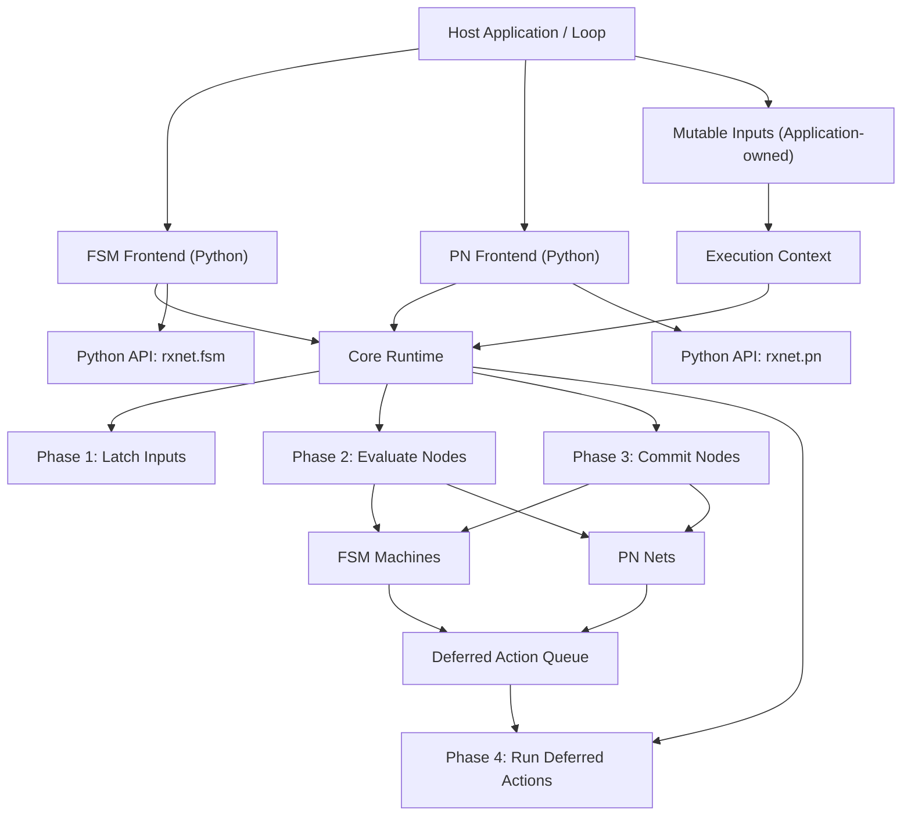

# Design Document: rxnet — Python Implementation

## Overview

This document outlines the design for the Python implementation of `rxnet`, a synchronous reactive runtime library with two model frontends (Finite State Machine and Petri Net) built on a shared phase-based core.

The core design decision is to centralize tick orchestration (`latch -> evaluate -> commit -> dump`, with deferred action dispatch between commit and dump) and let each model frontend implement only model-specific behavior on top of a generic node contract.

The design emphasizes deterministic execution, explicit input snapshotting, deferred side effects, and ergonomic dataclass-based APIs using only standard-library modules.

## Architecture

### High-Level Architecture

::: {#fig:py-hl-arch}

High-level architecture of the `rxnet` Python runtime and model frontends
:::

### Component Architecture

The system follows a layered runtime architecture:

1. **Host Integration Layer**: Application-owned inputs, tick scheduling, and output side effects
2. **Model Frontends**: FSM and PN model APIs (`rxnet.fsm`, `rxnet.pn`)
3. **Core Runtime Layer**: Generic node container and phase-ordered tick execution (`rxnet.runtime`)
4. **Execution Context Layer**: Live inputs, latched snapshot, deferred action queue
5. **Model Nodes**: Concrete node implementations (`Machine`, `Net`) with evaluate/commit logic

## Components and Interfaces

### Core Runtime

**Responsibilities:**
- Maintain a list of executable nodes
- Execute deterministic tick phases
- Coordinate context latch and deferred actions
- Provide minimal lifecycle surface (`add_node`, `tick`)

**Key Interfaces:**
```python
class Node(Protocol):
    def evaluate(self, ctx: Context) -> None: ...
    def commit(self, ctx: Context) -> None: ...

class Runtime:
    def add_node(self, node: Node) -> None: ...
    def tick(self) -> None: ...
```

### Context

**Responsibilities:**
- Hold mutable application inputs (`inputs`)
- Hold immutable per-tick snapshot (`latched_inputs`)
- Queue and execute deferred actions

**Design Notes:**
- Latching is shallow copy (`copy.copy`)
- The deferred-action queue grows dynamically (no fixed capacity)

**Key Interfaces:**
```python
class Context:
    inputs: Any
    latched_inputs: Any
    def latch_inputs(self) -> None: ...
    def enqueue_deferred_action(self, fn: Any, user: Any) -> None: ...
    def run_deferred_actions(self) -> None: ...
```

### FSM Frontend

**Responsibilities:**
- Define machine transitions (`from_state`, `to_state`, `guard`, `action`)
- Evaluate first valid transition in declaration order
- Commit next state and enqueue optional deferred action
- Read shared latched inputs from context in guards/actions

**Key Interfaces:**
```python
@dataclass(frozen=True, slots=True)
class Transition:
    from_state: int
    to_state: int
    guard: Optional[Guard] = None
    action: Optional[Action] = None

@dataclass(slots=True)
class Machine:
    name: str
    state: int
    transitions: Sequence[Transition]
    user: Any = None
```

### Petri Net Frontend

**Responsibilities:**
- Represent places and transitions with consume/produce arcs
- Evaluate transition enablement by token availability and guards
- Apply transition deltas in commit phase
- Enqueue transition actions as deferred side effects

**Key Interfaces:**
```python
@dataclass(frozen=True, slots=True)
class Arc:
    place_id: int
    weight: int = 1

@dataclass(frozen=True, slots=True)
class Transition:
    consume: Sequence[Arc] = ()
    produce: Sequence[Arc] = ()
    guard: Optional[Guard] = None
    action: Optional[Action] = None

@dataclass(slots=True)
class Net:
    name: str
    places: Sequence[int]
    transitions: Sequence[Transition]
    user: Any = None
```

### Package API Surface

**Root package exports (`rxnet.__init__`):**
- `fsm` module
- `pn` module
- `runtime` module
- FSM-oriented aliases for convenient top-level imports

### Host Integration Layer

**Responsibilities:**
- Own and mutate live inputs before each tick
- Invoke tick in a periodic or event-driven loop
- Reset edge-triggered inputs when required by domain logic
- Implement side effects in action callbacks

**Supported Patterns:**
- Python script loops with explicit input driver objects (per `system.py` / `main.py` example structure)

## Data Models

### Runtime Model

```typescript
interface RuntimeModel {
  context: ContextModel
  nodes: NodeModel[]
  tickPhases: ['latch', 'evaluate', 'commit', 'dump']
}

interface ContextModel {
  inputs: unknown
  latchedInputs: unknown
  deferredActions: DeferredActionModel[]
}

interface DeferredActionModel {
  fn: Function
  user: unknown
}
```

### FSM Model

```typescript
interface FSMMachineModel {
  name: string
  state: number
  nextState: number
  transitions: FSMTransitionModel[]
  user?: unknown
}

interface FSMTransitionModel {
  fromState: number
  toState: number
  guard?: (ctx: unknown, user: unknown) => boolean
  action?: (ctx: unknown, user: unknown) => void
}
```

### PN Model

```typescript
interface PNNetModel {
  name: string
  places: number[]
  nextPlaces: number[]
  transitions: PNTransitionModel[]
  fireFlags: boolean[]
  user?: unknown
}

interface PNTransitionModel {
  consume: PNArcModel[]
  produce: PNArcModel[]
  guard?: (ctx: unknown, user: unknown) => boolean
  action?: (ctx: unknown, user: unknown) => void
}

interface PNArcModel {
  placeId: number
  weight: number
}
```

## Correctness Properties

*A property is a behavior that should hold for all valid executions. Properties connect requirements with verifiable guarantees in unit, integration, and property-based tests.*

### Property 1: Phase Ordering Determinism
*For any* tick execution, phase order should always be `latch -> evaluate -> commit -> dump`, with deferred action dispatch after commit and before dump.
**Validates: Requirements 1.1, 1.2, 1.3, 1.4, 1.5, 1.6**

### Property 2: Snapshot Consistency Within Tick
*For any* guard evaluation during one tick, observed inputs should come from `latched_inputs` and remain stable for that tick.
**Validates: Requirements 2.1, 2.2, 2.3**

### Property 3: Deferred Action Isolation
*For any* action emitted during commit, execution should occur only after all nodes have completed commit.
**Validates: Requirements 3.1, 3.2**

### Property 4: Deferred Queue Reset
*For any* completed tick, deferred queue length should be zero after running deferred actions.
**Validates: Requirements 3.3**

### Property 5: Runtime Node Contract Safety
*For any* node registered in the runtime, `evaluate` and `commit` should both be callable in every tick.
**Validates: Requirements 4.1**

### Property 6: FSM First-Match Transition Rule
*For any* FSM machine and state, transition selection should be the first declaration-order transition that matches state and guard.
**Validates: Requirements 5.1, 5.2**

### Property 7: FSM No-Match Stability
*For any* FSM tick with no valid transition, machine state should remain unchanged.
**Validates: Requirements 5.3**

### Property 8: FSM Deferred Action Behavior
*For any* matched FSM transition with action, the action should be queued for deferred execution, not run inline.
**Validates: Requirements 5.5**

### Property 9: PN Transition Enablement
*For any* PN transition, firing should require valid arcs and sufficient consume tokens.
**Validates: Requirements 6.2**

### Property 10: PN Guard Enforcement
*For any* enabled PN transition with guard, transition should fire only when guard is true.
**Validates: Requirements 6.3**

### Property 11: PN Commit Delta Correctness
*For any* set of fireable PN transitions, place deltas should match arc consume/produce sums in commit.
**Validates: Requirements 6.4**

### Property 12: PN Invalid Arc Exceptions
*For any* Python PN evaluation with invalid arc data, runtime should raise typed exceptions (`IndexError` / `ValueError`).
**Validates: Requirements 7.1, 7.2**

### Property 13: Python API Surface Stability
*For any* supported Python import path, package exports and runtime wrappers should match documented API.
**Validates: Requirements 8.1, 8.2, 8.3, 8.4**

### Property 14: Example Executability
*For any* provided Python example entrypoint, example should run and complete without runtime errors in a valid Python environment.
**Validates: Requirements 9.1, 9.2**

### Property 15: Host-Controlled Scheduling
*For any* deployment context, tick frequency and loop ownership should remain controlled by host code, not by runtime internals.
**Validates: Requirements 10.3**

## Error Handling

### Error Categories

**1. Model Validation Errors (exception based)**
- PN invalid `place_id` → raises `IndexError`
- PN negative arc weight → raises `ValueError`

**2. Integration Errors**
- Host passes invalid input lifetimes
- Host loop omits input reset logic for edge-triggered signals

### Error Handling Strategy

**Fail-fast typed exceptions:**
- Invalid PN arc data raises typed exceptions during evaluation
- User callbacks may raise and should be handled by host application policy

**Host strategy: explicit loop ownership**
- Host catches exceptions per tick
- Host applies retry/abort policy appropriate to the runtime context

## Testing Strategy

### Unit Tests

Focus on:
- Per-function semantics in runtime/fsm/pn modules
- Edge cases (empty transitions, invalid arcs)
- Correct deferred action behavior

### Property Tests

**Framework:** `hypothesis`

**Configuration guidelines:**
- Minimum 100 runs per property
- Each property references its design property number
- Seeded reproducibility for failure triage

**Example Property Test Structure:**
```python
# Property 6: FSM First-Match Transition Rule
@given(st.lists(transition_strategy, min_size=1, max_size=20))
def test_fsm_first_match_ordering(transitions):
    machine = Machine(name="m", state=0, transitions=transitions)
    rt = Runtime(inputs=DummyInputs())
    rt.add_machine(machine)
    rt.tick()
    # Assert selected transition corresponds to first matching transition
```

### Integration Tests

Focus on:
- Host inputs mutation -> runtime tick -> state update -> deferred side effects
- Multiple nodes sharing one context input struct
- Python example execution paths

## Code Quality and Development Standards

- Use type hints and dataclasses consistently
- Keep runtime/frontend modules dependency-light (standard library only in core)
- Preserve API compatibility for existing imports from `rxnet.__init__`

## Non-Goals and Out-of-Scope

- No built-in networking or REST API layer
- No built-in persistence, serialization, or storage backends
- No built-in scheduler, thread pool, or realtime policy manager
- No automatic synchronization for concurrent access to one runtime instance

These concerns are intentionally delegated to host applications.
